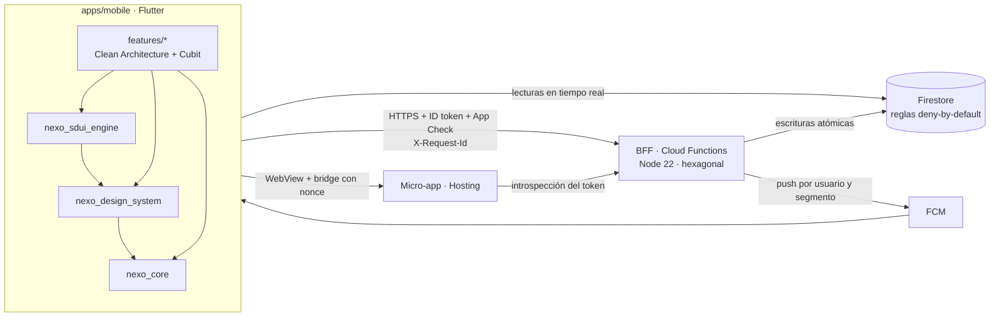

# Nexo — plataforma financiera digital

Prueba técnica · Senior Flutter Mobile Developer · Banco Internacional.

Nexo es el núcleo de una plataforma financiera **100 % digital**: un shell móvil Flutter seguro que orquesta
dominios independientes (auth, cuentas, transferencias, experiencia, micro-apps, notificaciones). La experiencia
del home **se compone desde el servidor** (SDUI) según el segmento del cliente, así que el negocio puede cambiarla
**sin publicar una nueva versión**; terceros se integran como **micro-apps aisladas**; y todo lo que mueve dinero se
resuelve en el backend de forma atómica e idempotente.

**Qué funciona hoy (Android):** registro → onboarding → segmento → biometría y auto-lock · cuentas y movimientos en
tiempo real con modo offline · transferencia entre cuentas propias idempotente · home SDUI por segmento con cambio
en vivo · push FCM con deep links seguros · micro-app "Viaja Seguro" en WebView con bridge · kill switches por
servicio · Crashlytics y correlation id. Alcance completo y lo que quedó fuera en
[product-scope](docs/product-scope.md).

## Arquitectura



Las escrituras de dinero y perfil solo ocurren en el servidor. Detalle (C4, secuencias, regla de dependencias) en
[docs/architecture.md](docs/architecture.md).

| Ruta | Qué es |
|---|---|
| `apps/mobile` | App Flutter (shell + features, Clean Architecture feature-first, Cubit, get_it, go_router) |
| `packages/core` | `Money` (centavos `int`), `Result/Failure`, `ApiClient` (Dio) con interceptores y retry |
| `packages/design_system` | Tokens (Google Stitch, teal `#0F766E`), tema y componentes accesibles |
| `packages/sdui_engine` | Contrato Server-Driven UI, parser con allowlist, registry y renderer tolerante a fallos |
| `backend/functions` | BFF en Cloud Functions (Node 22 + TypeScript, Express, zod), arquitectura hexagonal |
| `micro_apps/travel_insurance` | Micro-app de un aliado (web) servida por Firebase Hosting |
| `firebase/` | Reglas de Firestore e índices |
| `stitch/` | Diseños de Google Stitch |
| `docs/` | Arquitectura, ADRs, API, seguridad, resiliencia, observabilidad, operación, IA |

## Requisitos

| Herramienta | Versión | Para qué |
|---|---|---|
| [FVM](https://fvm.app) | Flutter **3.47.4** (fijado en `.fvmrc`) | App y packages. Usar siempre `fvm flutter …` / `fvm dart …` |
| Node.js | **22** | Backend y Firebase CLI |
| Firebase CLI | 15.x | Emuladores y deploy |
| Java (JDK) | **21** para los emuladores de Firebase · **17** para Gradle/Android | Ajustar `JAVA_HOME` según el comando |
| Android SDK | con un emulador (AVD) o dispositivo | Plataforma principal de la demo |

## Setup desde un clone limpio

```bash
git clone https://github.com/codexnoise/fintech-mobile-app-demo.git && cd fintech-mobile-app-demo

# 1. Flutter (pub workspace: un solo pub get en la raíz)
fvm install
fvm dart pub get

# 2. Configuración de la app (los *.json reales no se versionan)
cp apps/mobile/env/dev.example.json       apps/mobile/env/dev.json        # emuladores locales
cp apps/mobile/env/dev-cloud.example.json apps/mobile/env/dev-cloud.json  # backend desplegado
cp apps/mobile/env/prod.example.json      apps/mobile/env/prod.json

# 3. Backend local con Firebase Emulator Suite (Java 21)
cp backend/functions/.secret.local.example backend/functions/.secret.local   # valores solo para dev
(cd backend/functions && npm ci && npm run build)
firebase emulators:start      # Auth 9099 · Firestore 8080 · Functions 5001 · Hosting 5000 · UI http://localhost:4000

# 4. App contra los emuladores (otra terminal, emulador Android encendido)
cd apps/mobile
fvm flutter run -t lib/main_dev.dart --dart-define-from-file=env/dev.json
```

Notas:

- El emulador Android llega al host por `10.0.2.2`; `env/dev.json` ya apunta a
  `http://10.0.2.2:5001/nexo-fintech-demo/us-east1/api`. El cleartext está permitido solo hacia `10.0.2.2` y
  `localhost` y solo en builds de debug.
- En emuladores el backend no exige App Check. Cada usuario nuevo recibe cuentas `checking`/`savings` sembradas
  de forma determinista; basta con registrarse desde la app. Las credenciales del usuario de demo del entorno
  desplegado se comparten por privado, no se publican.
- La micro-app siempre se carga desde la versión desplegada (`https://nexo-fintech-demo.web.app`).

### Variante `dev-cloud` (app de debug contra el backend desplegado)

```bash
cd apps/mobile
fvm flutter run -t lib/main_dev.dart --dart-define-from-file=env/dev-cloud.json
```

El backend desplegado exige App Check. En debug la app usa el *debug provider*: copia el debug token que imprime
el log al primer arranque, regístralo en Firebase Console → App Check → Manage debug tokens y, opcionalmente,
fíjalo en `APP_CHECK_DEBUG_TOKEN` de `env/dev-cloud.json`.

### Build de producción

```bash
cd apps/mobile
fvm flutter build apk --release -t lib/main_prod.dart --dart-define-from-file=env/prod.json \
  --obfuscate --split-debug-info=build/symbols
```

`main_prod.dart` usa Play Integrity; un APK instalado fuera de Play Store probablemente no pase la atestación
(ver [riesgos](docs/risks-assumptions.md)).

## Tests

```bash
make test                                   # Flutter: core 56 · design_system 13 · sdui_engine 18 · mobile 161 (248)
make analyze && make format
cd backend/functions && npm test            # backend: 56 (vitest + supertest, adaptadores en memoria)
make check                                  # format + analyze + test Flutter + test backend
```

E2E con `integration_test` pendiente (F9). Pirámide, fakes, accesibilidad y verificación manual en
[docs/testing.md](docs/testing.md).

## Deploy

Lo ejecuta una persona (el agente de IA tiene `firebase deploy` bloqueado). Proyecto: `nexo-fintech-demo`
(`.firebaserc`), región `us-east1`.

```bash
firebase functions:secrets:set MICROAPP_SIGNING_KEY    # p. ej. openssl rand -base64 48
firebase functions:secrets:set ADMIN_API_KEY
firebase functions:secrets:set GEMINI_API_KEY          # key de AI Studio o "disabled" (fallback determinista)
cp backend/functions/.env.example backend/functions/.env.<project-id>   # MICROAPP_ORIGINS, APP_CHECK_ENFORCED
firebase deploy --only functions,firestore,hosting
```

CI/CD (GitHub Actions): `ci.yml` en cada push/PR (format, analyze, tests con cobertura Flutter y backend,
sintaxis de la micro-app). `release.yml` con tag `v*`: APK ofuscado adjunto al GitHub Release y deploy de Firebase
opcional (`ENABLE_FIREBASE_DEPLOY` + service account). Entornos, rollback y runbooks en
[deployment-operations](docs/deployment-operations.md).

## Colaboración

- **Trunk Based Development:** commits pequeños y frecuentes a `main`, siempre verde (CI en cada push).
- **Conventional Commits:** `feat(scope): …`, `fix`, `test`, `docs`, `refactor`, `chore`, `ci`.
- **Antes de commitear:** `make format analyze test` (y `npm test` si tocaste el backend). Todo cambio de lógica
  llega con su test.
- **Agentes de IA:** [`CLAUDE.md`](CLAUDE.md) define reglas de arquitectura, comandos y zonas que requieren
  aprobación humana (reglas de Firestore, transferencias, middleware, auth, bridge). `.mcp.json` habilita el Dart
  MCP server para hot reload agéntico; `.claude/settings.json` fija permisos y el hook de formato.
- Al cerrar una tarea se agrega una fila a [`docs/ai/ai-log.md`](docs/ai/ai-log.md).

## Documentación

| Documento | Contenido |
|---|---|
| [architecture.md](docs/architecture.md) | C4, secuencias, regla de dependencias, backend hexagonal |
| [adr/](docs/adr/) | Decisiones de arquitectura (Problema · Alternativas · Opción · Trade-offs · Impacto) |
| [api.md](docs/api.md) | Contrato del BFF (endpoints, errores, idempotencia) |
| [security-owasp.md](docs/security-owasp.md) | OWASP Mobile Top 10 (2024): implementado vs. pendiente |
| [resilience.md](docs/resilience.md) | Escenarios degradados y comportamiento |
| [observability.md](docs/observability.md) | Crashlytics, logs, correlation id, SLOs y alertas |
| [deployment-operations.md](docs/deployment-operations.md) | Entornos, pipeline, kill switches, runbooks |
| [testing.md](docs/testing.md) | Pirámide de pruebas y cómo correrlas |
| [ux.md](docs/ux.md) | Principios UX aplicados y pantallas de Stitch |
| [product-scope.md](docs/product-scope.md) | Construido / cortado / por qué / valor |
| [risks-assumptions.md](docs/risks-assumptions.md) | Supuestos, riesgos, mitigaciones y siguientes pasos |
| [ai/ai-usage.md](docs/ai/ai-usage.md) | Impacto medido de la IA y cómo se controló |
| [ai/ai-log.md](docs/ai/ai-log.md) | Registro por tarea |
| [ai/prompts/](docs/ai/prompts/flutter-blocks.md) | Prompts versionados por bloque |
