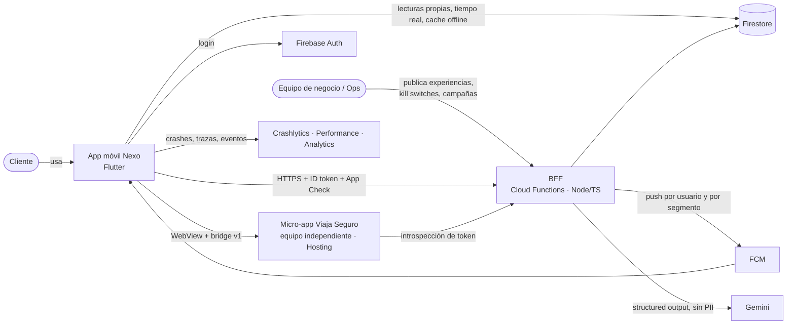
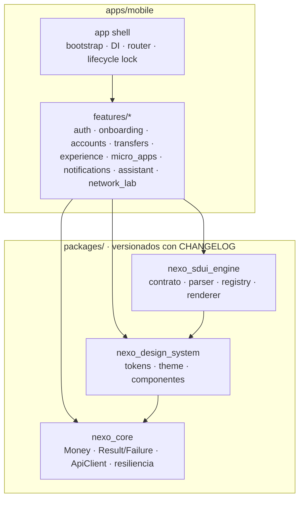
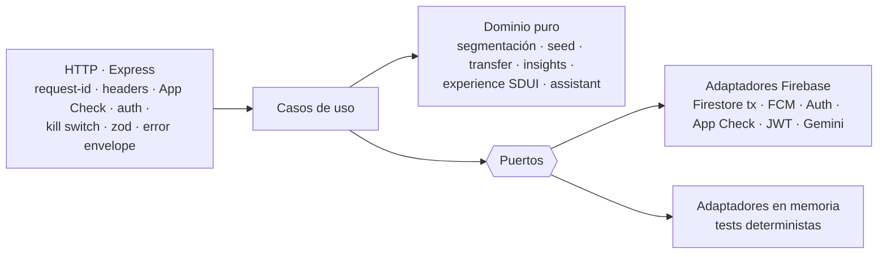
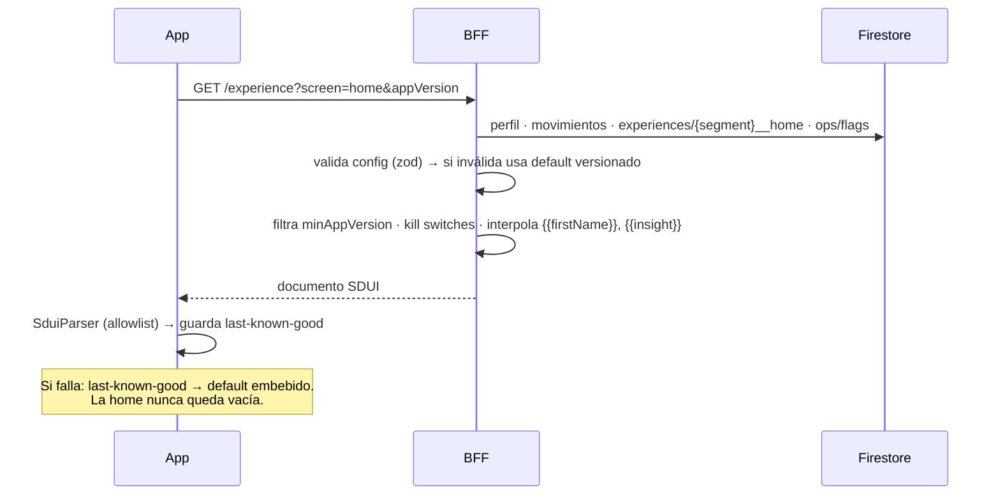
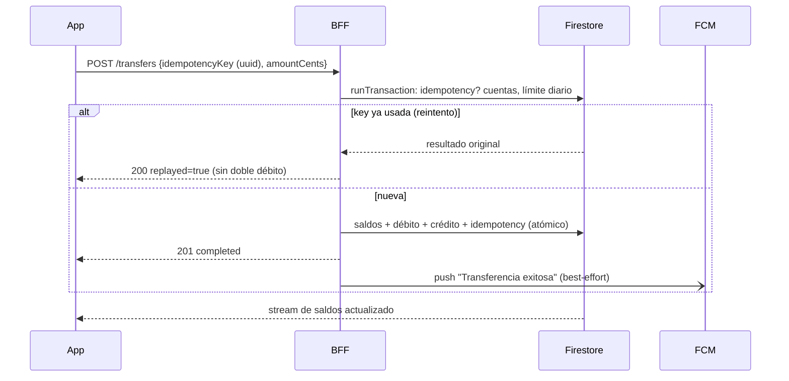
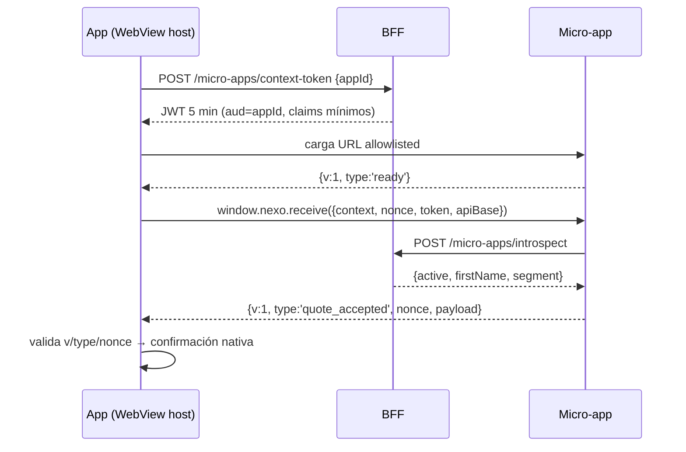

# Arquitectura — Nexo

Nexo es el núcleo de una **plataforma financiera digital componible**: un shell móvil Flutter
seguro que orquesta dominios independientes (identidad, cuentas, transferencias, experiencias,
micro-apps). La experiencia se **compone desde el servidor** (SDUI) según el segmento y el
comportamiento del cliente, terceros se integran como **micro-apps aisladas**, y todo lo que
mueve dinero o identidad es **determinista y server-side**.

> Decisiones detalladas en [`docs/adr/`](./adr). Contrato del backend en [`docs/api.md`](./api.md).

## 1. Contexto (C4 nivel 1)

## 2. Contenedores y dependencias del monorepo (C4 nivel 2)

**Regla de dependencias:** `apps/mobile → packages/*` y `sdui_engine → design_system → core`. Nunca al
revés; las features no se importan entre sí (se comunican por rutas y contratos de `core`).
Cada feature sigue Clean Architecture: `domain` (Dart puro) · `data` (Dio/Firestore → `Result<T>`) ·
`presentation` (Cubit + sealed states).

## 3. Backend: arquitectura hexagonal

Toda escritura pasa por el BFF (las reglas de Firestore niegan escrituras del cliente). Las
transferencias corren en una transacción de Firestore con **idempotency key** (TTL 24 h).

## 4. Flujos clave

### 4.1 Home personalizada (SDUI) con cascada de fallback

### 4.2 Transferencia idempotente + push

### 4.3 Micro-app con token de contexto

## 5. Escalamiento y evolución

| Hoy | Evolución |
|---|---|
| Features como módulos internos de la app | Package por feature → equipos dueños de dominio con releases independientes |
| Packages en el mismo repo (pub workspace) | Multirepo con registry privado de packages y versionado semver |
| SDUI con 8 componentes y config por segmento | Versionado/rollback de experiencias, A/B testing, targeting por reglas de comportamiento |
| Micro-apps web en WebView | Micro-apps nativas/Flutter cargadas por feature flag; SDK de bridge publicado para aliados |
| Un proyecto Firebase | Proyectos dev/staging/prod, staged rollout, kill switches por región |
| Core bancario simulado en Firestore | Adaptador del puerto `Ledger` hacia el core real (sin tocar casos de uso) |
