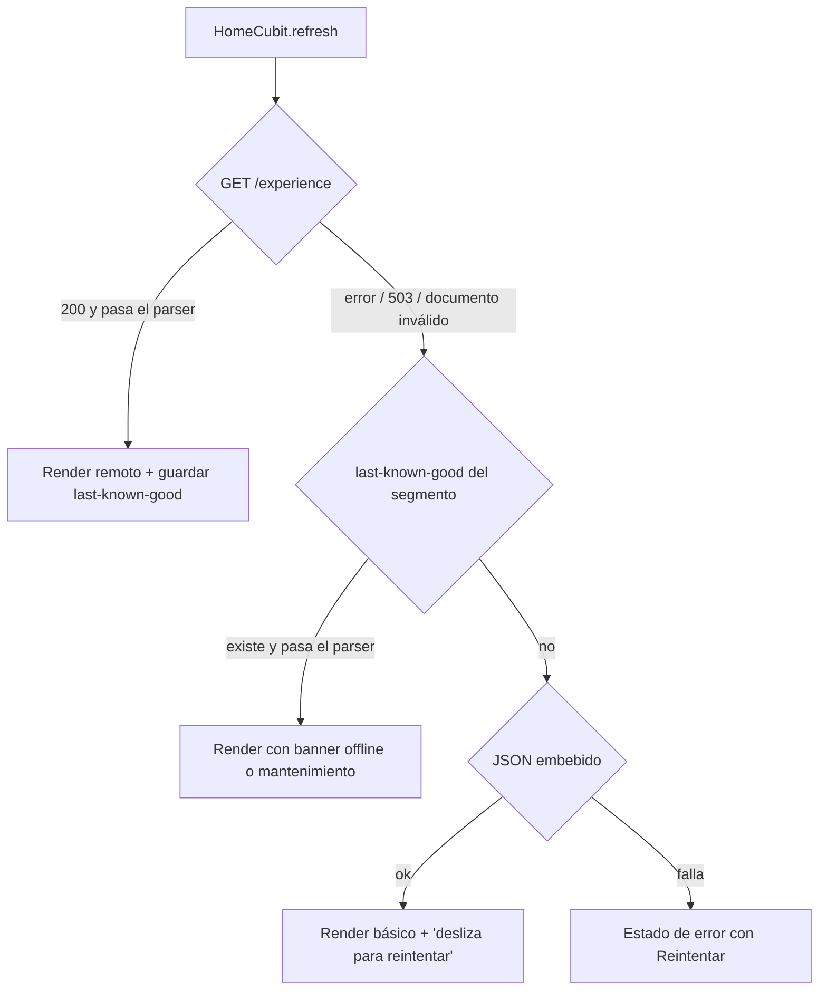

# Resiliencia

Cómo se comporta Nexo cuando la red, el backend o un aliado fallan, y cómo demostrarlo.
Estado: ✅ implementado · 📄 evolución.

Principios:
1. **Leer siempre algo útil**: datos en caché antes que una pantalla vacía, con un aviso honesto de que no son frescos.
2. **Nunca mover dinero a ciegas**: las transferencias no se encolan offline y solo se reintentan con la misma idempotency key.
3. **Degradar por partes**: un servicio caído (SDUI, micro-app, asistente) no tumba el resto de la app.

## Mecanismos base (✅)

| Mecanismo | Dónde | Detalle |
|---|---|---|
| Timeouts | `packages/core/lib/src/network/api_client.dart` | connect 5 s, receive 10 s |
| Reintentos | `RetryInterceptor` en `packages/core/lib/src/network/interceptors.dart` | Máx. 3, backoff exponencial con *equal jitter* (base 400 ms, tope 4 s). Solo GET/HEAD o requests marcados `idempotent`. Reintenta timeouts, errores de conexión, 502/504 y 503 con `Retry-After` ≤ 4 s; con `Retry-After` largo no reintenta y la UI muestra mantenimiento |
| Correlación en reintentos | `RequestIdInterceptor` | El `X-Request-Id` se conserva en todos los intentos de un mismo request lógico |
| Caché de Firestore | `apps/mobile/lib/features/accounts/data/firestore_accounts_repository.dart` | Snapshots con `includeMetadataChanges`; `isFromCache` alimenta el banner "sin conexión / datos guardados" |
| Cascada SDUI | `apps/mobile/lib/features/experience/data/cascading_experience_repository.dart` | Remoto → last-known-good → embebido (ver abajo) |
| Kill switches | `requireService` en `backend/functions/src/http/middleware.ts` | `ops/flags.degradedServices` → 503 `service_unavailable` + `Retry-After: 120` |
| Idempotencia | `executeTransfer` en `backend/functions/src/adapters/firebase.ts` | Transacción Firestore + doc `idempotency/{uid}_{key}` con TTL de 24 h |

## Matriz de escenarios

| Escenario | Comportamiento | Cómo demostrarlo |
|---|---|---|
| **Sin conexión** | Cuentas y movimientos desde la caché de Firestore con banner offline. Home desde last-known-good con aviso "Sin conexión. Mostrando tu inicio guardado.". Transferencias bloqueadas con mensaje claro: **no se encolan** (decisión de producto: el usuario debe ver el resultado real). | Modo avión real en el dispositivo tras una primera carga. Network Lab → "Sin conexión" lo reproduce para las llamadas al BFF sin tocar el WiFi. |
| **Alta latencia** | Skeletons mientras carga; la UI no se bloquea. Si se supera el `receiveTimeout`, los GET se reintentan con backoff; si todo falla, la home cae a la cascada y las cuentas siguen en caché. | Network Lab → "Latencia +3 s": la home tarda pero carga; con varios intentos fallidos se ve el fallback. |
| **Caída parcial de SDUI** | `GET /experience` falla → se usa el last-known-good del segmento; si no hay, el JSON embebido (`apps/mobile/assets/sdui/default_home.json`). Un componente que lanza al construirse se omite y se reporta como no fatal; el resto de la home se dibuja. | `PUT /admin/flags` con `{"degradedServices":["experience"]}` → banner "Estamos actualizando tu inicio…". Network Lab → "Forzar 503" (verificado). |
| **Micro-app caída** | Si el token de contexto falla (503) se muestra "*Viaja Seguro* no está disponible por ahora"; si el frame principal no carga, estado de error con reintento. Con `microAppsEnabled:false` el backend retira el tile de la home. Circuit breaker: tras 3 fallas seguidas de `micro-apps`, abrirla falla rápido con el mismo mensaje durante 30 s. | `PUT /admin/flags` con `{"microAppsEnabled":false}` y pull-to-refresh: el tile desaparece. Con `{"degradedServices":["micro_apps"]}` el tile sigue y abrirlo muestra el mensaje de no disponible. |
| **Servicio degradado (kill switch)** | El backend responde 503 + `Retry-After: 120`. La app no reintenta (espera larga) y muestra "Transferencias en mantenimiento". El resto de la app sigue operativo. | `curl` de abajo; esperar hasta 30 s (caché de flags por instancia) y abrir Transferir. |
| **Transferencia con resultado incierto** | Error de red/timeout/5xx tras enviar: el cubit **conserva** la `idempotencyKey` y avisa "Si reintentas, no se duplicará la transferencia". El reintento devuelve `200` con `replayed:true` si ya se había ejecutado. La key se descarta ante éxito, rechazo definitivo (422) o si el usuario edita. Reusar la key con otro monto → 422 `idempotency_key_reused`. | Test `apps/mobile/test/features/transfers/transfer_cubit_test.dart` y tests de idempotencia en `backend/functions/test/`. Network Lab: "Forzar 503" muestra "Transferencias en mantenimiento"; "Sin conexión" simula el error de red tras confirmar. |
| **Token expirado (401)** | `AuthInterceptor` pide un ID token nuevo (`forceRefresh`) y reintenta **una sola vez**; si vuelve a fallar sube como `UnauthorizedFailure` ("Tu sesión expiró. Ingresa nuevamente."). Si la cuenta está deshabilitada/revocada, el BFF lo detecta (`checkRevoked`). | Test `packages/core/test/network/api_client_test.dart`. |

### Kill switch en vivo

```bash
API=https://us-east1-nexo-fintech-demo.cloudfunctions.net/api
# Degradar transferencias
curl -X PUT "$API/admin/flags" -H "X-Admin-Key: $ADMIN_API_KEY" \
  -H "Content-Type: application/json" -d '{"degradedServices":["transfers"]}'
# Restaurar
curl -X PUT "$API/admin/flags" -H "X-Admin-Key: $ADMIN_API_KEY" \
  -H "Content-Type: application/json" -d '{"degradedServices":[]}'
```

Servicios válidos: `onboarding`, `experience`, `transfers`, `micro_apps`, `assistant`. Además `microAppsEnabled` y
`assistantEnabled` retiran tiles y acciones del documento SDUI. Los flags tienen caché de 30 s por instancia
(`FirestoreFlags`), así que el cambio puede tardar hasta 30 s en verse.

## Cascada SDUI



- Solo se guarda en caché lo que pasó el parser: la caché nunca contiene un documento roto.
- La clave es `sdui.lkg.<screen>.<segment>` en `shared_preferences`; se borra en logout (incluye el nombre del saludo).
- `ttlSeconds` del documento se respeta en refrescos automáticos; pull-to-refresh fuerza la red.
- En el servidor hay una segunda red de seguridad: si la configuración publicada en `experiences/{segment}__home` es inválida, se usa el default versionado en `backend/functions/src/experience/defaults/`.
- `balance_summary` es un *slot* de la app: los saldos vienen de Firestore, nunca del documento SDUI.

## ✅ Network Lab y circuit breaker (F7)

- **Network Lab** (`apps/mobile/lib/features/network_lab/network_lab_page.dart`, ruta `/dev/network-lab`
  registrada solo si `env.isDev`; acceso desde el ícono de matraz en Inicio). Configura `ChaosSettings`, que lee el
  `ChaosInterceptor` (`packages/core/lib/src/network/interceptors.dart`), ubicado antes del `RetryInterceptor`
  para que los reintentos también atraviesen el caos. Afecta solo las llamadas al BFF; Firestore se prueba con el
  modo avión real.
  - **Sin conexión**: todo request falla como error de conexión (sin tocar la red).
  - **Latencia +3 s**: espera inyectada antes de cada request.
  - **Forzar 503**: respuesta sintética `service_unavailable` con `Retry-After: 60` (el retry no insiste).
  - Estado del circuit breaker por servicio y botón **Restablecer todo**.
- **Circuit breaker** por servicio (`packages/core/lib/src/network/circuit_breaker.dart`, usado en `ApiClient._send`,
  fuera de Dio para contar el resultado final tras los reintentos). Servicio = primer segmento de la ruta
  (`experience`, `transfers`, `micro-apps`…). Abre tras 3 fallas de infraestructura seguidas (red, timeout, 503,
  5xx); los rechazos de negocio (4xx) no cuentan. Abierto: falla rápido 30 s con "Este servicio no responde";
  luego deja pasar una prueba (half-open).
- Verificado en emulador contra el backend desplegado: con "Forzar 503" el home muestra el último documento
  guardado con el aviso de mantenimiento mientras los saldos siguen en vivo desde Firestore; tras 3 refrescos el
  circuito `experience` queda **Abierto** en el Network Lab.
- El Network Lab no existe en builds de producción (`main_prod.dart`): la ruta no se registra.

## Decisiones

- **Sin cola offline de transferencias**: encolar dinero genera resultados diferidos inciertos y conflictos de saldo. Se prefiere bloquear con un mensaje claro.
- **Reintentar solo lo seguro**: POST no se reintenta salvo que el BFF deduplique (`idempotent: true` en `ApiTransfersRepository`).
- **Respetar `Retry-After`**: con mantenimiento largo no se insiste; se muestra el estado y el usuario decide.

Relacionado: [operación y runbooks](deployment-operations.md) · [observabilidad](observability.md) · [contrato del BFF](api.md).
