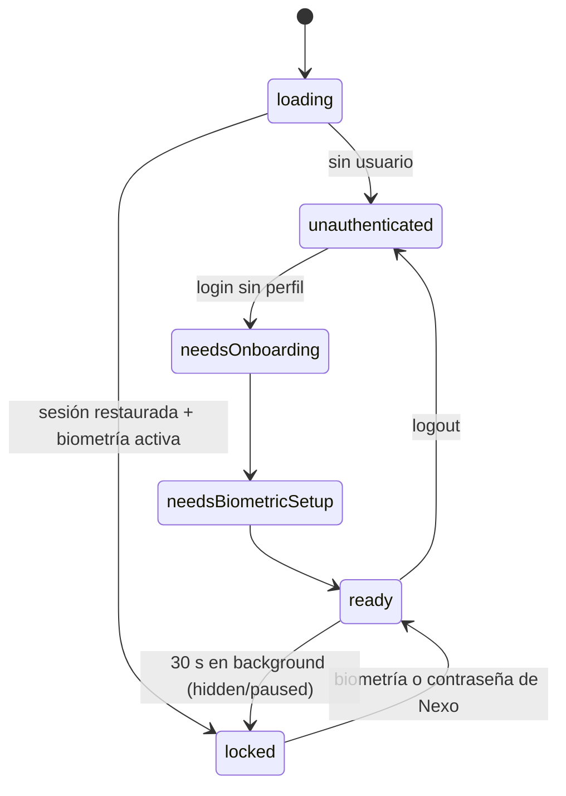

# Seguridad — OWASP Mobile Top 10 (2024)

Postura de seguridad de Nexo frente a OWASP Mobile Top 10 (2024). La columna **Estado** refleja lo que
existe hoy en el repo, no el plan: ✅ implementado · 📄 documentado como evolución · 🚧 en curso.

Principio rector: **el cliente no es de confianza**. Toda escritura (dinero, perfil, dispositivos,
experiencias, flags) pasa por el BFF (`backend/functions`), y la app solo lee de Firestore sus propios datos.

## Tabla M1–M10

| OWASP | Riesgo | Control en Nexo | Evidencia | Estado |
|---|---|---|---|---|
| M1 Improper Credential Usage | Secretos en el binario | Cero secretos en la app; `env/*.json` solo trae config pública (URL del BFF, flags de entorno). Firma JWT, admin key y Gemini en Secret Manager | `apps/mobile/env/*.example.json`, `backend/functions/src/index.ts` (`defineSecret`) | ✅ |
| M2 Inadequate Supply Chain Security | Dependencias comprometidas | Lockfiles versionados (`pubspec.lock` del workspace, `package-lock.json`), `npm ci` en CI, Dependabot semanal (pub, npm, GitHub Actions) | `pubspec.lock`, `backend/functions/package-lock.json`, `.github/dependabot.yml` | ✅ |
| M3 Insecure AuthN/AuthZ | Acceso a datos ajenos | Firebase Auth; el BFF verifica el ID token con `checkRevoked=true` en cada ruta autenticada; transferencias leen cuentas bajo `users/{uid}` del token; reglas Firestore deny-by-default, lectura solo del dueño | `backend/functions/src/http/middleware.ts` (`authenticate`), `src/adapters/firebase.ts`, `firebase/firestore.rules` | ✅ |
| M3 | Sesión expuesta en el dispositivo | Biometría `biometricOnly` (sin fallback a PIN del equipo; lockout → contraseña de Nexo), sesión restaurada abre `/lock`, auto-lock tras 30 s en background | `apps/mobile/lib/features/auth/data/local_biometrics.dart`, `lib/app/session/auto_lock.dart` | ✅ |
| M4 Insufficient Input/Output Validation | Montos/IDs manipulados | zod `strictObject` en cada body, límite de 32 KB, montos `int` en centavos, límites por transferencia y diario, idempotency key uuid v4; validación en cliente solo como UX | `backend/functions/src/http/app.ts`, `src/domain/transfer.ts` | ✅ |
| M4 | SDUI y bridge como vector | Registry cerrado de 8 tipos, acciones allowlisted (`navigate`, `open_micro_app`, `open_assistant`), parser defensivo; bridge con schema v1, nonce y tope de 8 KB | `packages/sdui_engine/lib/src/sdui_parser.dart`, `apps/mobile/lib/features/micro_apps/domain/micro_app.dart` | ✅ |
| M5 Insecure Communication | MITM / tráfico en claro | Solo HTTPS en release; el `network_security_config` que permite cleartext existe **solo en debug** y únicamente hacia `10.0.2.2`/`localhost`/`127.0.0.1` (emuladores); App Check en cada request | `apps/mobile/android/app/src/debug/res/xml/network_security_config.xml`, `packages/core/lib/src/network/interceptors.dart` | ✅ |
| M5 | Certificate / SPKI pinning | No implementado. Trade-off: rotación de certificados de Google Front End; requiere pinning a CA intermedia + plan de rotación | — | 📄 |
| M6 Inadequate Privacy Controls | PII en logs/IA/terceros | Logs sin PII con `uid` hasheado (SHA-256, 12 hex); micro-app recibe claims mínimos (`firstName`, `segment`); el asistente trabaja sobre agregados; saldos nunca viajan en el documento SDUI | `backend/functions/src/logger.ts`, `src/application/use-cases.ts` | ✅ |
| M7 Insufficient Binary Protections | Ingeniería inversa | Release con `--obfuscate --split-debug-info` (R8 por defecto de Flutter en release) | `.github/workflows/release.yml` | ✅ |
| M7 | Root/jailbreak | Sin detección. Política propuesta: advertir y bloquear transferencias en dispositivos comprometidos, apoyada en el veredicto de Play Integrity | — | 📄 |
| M8 Security Misconfiguration | Debug/backup en prod | `android:allowBackup="false"`; entrypoints `main_dev.dart` / `main_prod.dart`; Network Lab registrado solo si `env.isDev`; Crashlytics apagado en dev; App Check exigido en el BFF desplegado (`APP_CHECK_ENFORCED=true`) | `apps/mobile/android/app/src/main/AndroidManifest.xml`, `apps/mobile/lib/app/router.dart`, `backend/functions/.env.example` | ✅ |
| M9 Insecure Data Storage | Tokens/flags en claro | Flags de biometría en `flutter_secure_storage` (Keystore / Keychain `first_unlock_this_device`); tokens los maneja Firebase Auth; logout limpia Firestore (`terminate` + `clearPersistence`), caché SDUI y token FCM | `apps/mobile/lib/features/auth/data/local_biometrics.dart`, `lib/app/infra/firestore_cleanup.dart`, `lib/app/di.dart` | ✅ |
| M9 | Fuga visual (capturas, app switcher) | `FLAG_SECURE` en Android y ocultar contenido en el app switcher de iOS — no implementado (bloque F10) | — | 📄 |
| M10 Insufficient Cryptography | Cripto casera | Sin cripto propia: JWT HS256 con la librería estándar `jose`, hashing con `node:crypto`, almacenamiento con APIs del SO | `backend/functions/src/adapters/firebase.ts`, `src/logger.ts` | ✅ |

## Hardening del WebView y bridge (micro-apps)

Implementado en `apps/mobile/lib/features/micro_apps/` (ver también [`micro_apps/travel_insurance/README.md`](../micro_apps/travel_insurance/README.md)):

- **Navegación:** `NavigationDelegate` solo permite `https` hacia `nexo-fintech-demo.web.app`; cualquier otro host o esquema se bloquea.
- **Sin acceso local:** `setAllowFileAccess(false)` y `setAllowContentAccess(false)` en Android.
- **Token de contexto, no de sesión:** `POST /micro-apps/context-token` emite un JWT de 5 min con `aud=travel_insurance` y claims mínimos; la micro-app lo valida con `POST /micro-apps/introspect` (CORS solo a `MICROAPP_ORIGINS`). El ID token del banco nunca entra al WebView.
- **Bridge v1:** canal `NexoBridge`; nonce de `Random.secure()` generado al recibir `ready`; parser estricto (`v == 1`, tipos allowlisted, nonce igual, ≤ 8 KB); el contexto se inyecta con `jsonEncode` (sin interpolar strings).
- **Limpieza:** al cerrar se borran cookies, caché y local storage. Acciones con impacto (`quote_accepted`) muestran confirmación nativa.
- **Hosting:** CSP estricta (`default-src 'self'`, `frame-ancestors 'none'`, `form-action 'none'`), `Referrer-Policy: no-referrer`, `Permissions-Policy` restrictiva (`firebase.json`).

## Modelo de sesión

- Máquina de estados en `apps/mobile/lib/app/session/session_cubit.dart`; los guards son una función pura (`session_redirect.dart`) con tests.
- Biometría `biometricOnly`; si el sensor queda bloqueado, el usuario reingresa la contraseña de Nexo (`reauthenticate`), no el PIN del dispositivo.
- Los deep links de push pasan por `DeepLinkGate`: allowlist de rutas y apertura solo con app en primer plano y sesión `ready`.
- **Logout:** ejecuta las limpiezas registradas (`SessionCleanupRegistry`), borra flags biométricos y llama a `signOut` al final. El backend verifica revocación del token, por lo que deshabilitar la cuenta corta la sesión en el siguiente request.
- Reset de contraseña sin enumeración de usuarios (mismo mensaje exista o no el correo).

## App Check

- App: Play Integrity / DeviceCheck en prod y debug provider en dev, con el debug token inyectado por `env` (`lib/app/bootstrap.dart`).
- `AppCheckInterceptor` agrega `X-Firebase-AppCheck`; si la atestación falla, el request sale sin header y decide el servidor.
- BFF: middleware `appCheck` en todas las rutas autenticadas. Desplegado con `APP_CHECK_ENFORCED=true`; verificado que `GET /me` sin token responde `401 app_check_failed`. En emuladores se omite (`FUNCTIONS_EMULATOR`).

## Secretos

- `MICROAPP_SIGNING_KEY`, `ADMIN_API_KEY`, `GEMINI_API_KEY` viven en Secret Manager (`firebase functions:secrets:set …`). `GEMINI_API_KEY=disabled` activa el fallback determinista del asistente.
- Local: `backend/functions/.secret.local` (ignorado por git; plantilla en `.secret.local.example`).
- `.claude/settings.json` niega a los agentes de IA la lectura de archivos de secretos.
- `google-services.json` y `firebase_options.dart` están versionados: son identificadores públicos de Firebase, no secretos; la protección real son reglas + App Check.

## Riesgos aceptados

| Riesgo | Por qué se acepta | Mitigación |
|---|---|---|
| Caché offline de Firestore sin cifrar | Necesaria para offline; el SDK no ofrece cifrado | Solo datos del propio usuario, limpieza en logout; evolución: SQLCipher o deshabilitar persistencia en dispositivos sin cifrado |
| Play Integrity falla en APK instalado fuera de Play | La demo no se distribuye por Play Store | Demo con build dev + debug token registrado; en prod, distribución por Play |
| Release firmado con la clave debug | Prueba técnica sin keystore propio | En prod: keystore en GitHub Secrets / Play App Signing |
| Sin pinning ni detección de root | Costo de operación y falsos positivos | 📄 ver tabla; App Check cubre parte del riesgo de clientes no genuinos |
| Sin `FLAG_SECURE` | Bloque F10 pendiente, priorizado después de P0 | 📄 implementación nativa en `MainActivity` |
| Micro-app sin timeout de carga y validación parcial del payload | Versión simple acordada | El error de carga del frame principal se muestra con reintento; evolución: timeout + schema completo |
| `PUT /admin/*` con API key | Habilita la demo en vivo | En producción: backoffice con IAM y auditoría |
| iOS no compilado en esta iteración | Foco en Android para la demo | Código multiplataforma; Keychain y DeviceCheck ya configurados en Dart |

Relacionado: [resiliencia](resilience.md) · [observabilidad](observability.md) · [operación](deployment-operations.md) · [contrato del BFF](api.md).
